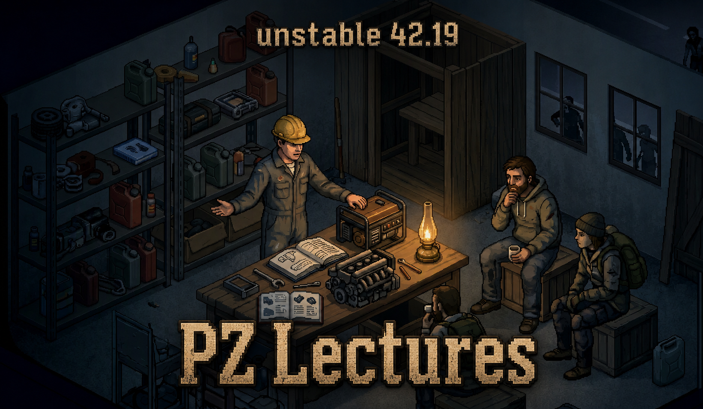

<p align="center">
  
</p>

# PZ Lectures

PZ Lectures is a multiplayer-focused mod for **Project Zomboid Build 42.19** that lets experienced survivors teach Crafting skills to nearby teammates through timed group lectures.

[](https://steamcommunity.com/sharedfiles/filedetails/?id=3749459391)


## Features

- Conduct lectures by right-clicking another nearby player.
- The lecture menu always appears; only skills that meet the configurable teacher-level requirement are available.
- Nearby survivors receive an invitation and choose whether to participate.
- Lectures require a configurable minimum number of listeners.
- Only accepted participants who remain until completion receive experience.
- Existing skill progress is never reduced.
- Rewards stop at a configurable skill level and progress cap.
- Lecture state and rewards are validated by the server.
- Includes English and Ukrainian localization.

## Supported skills

All Crafting-category skills available in Build 42.19 are supported:

- Carving
- Glassmaking
- Flint Knapping
- Masonry
- Pottery
- Mechanics
- Carpentry
- Welding
- Electrical
- Blacksmithing
- Cooking
- Tailoring

## How lectures work

1. A survivor reaches the required level in a supported Crafting skill.
2. The teacher right-clicks another player and selects **Conduct Lecture**.
3. The teacher chooses one of their eligible skills.
4. Nearby survivors receive an invitation.
5. When enough survivors accept, the synchronized lecture begins.
6. Participants who finish the lecture receive experience up to the configured cap.

By default, teachers need level **6**, a lecture lasts **30 seconds**, its radius is **5 tiles**, and listeners can progress up to level **4 plus 50%** toward level 5.

## Installation

### Steam Workshop

Subscribe on the [Steam Workshop page](https://steamcommunity.com/sharedfiles/filedetails/?id=3749459391), restart Project Zomboid if it is already running, and enable **PZ Lectures** in the Mods menu.

### Multiplayer hosting

Project Zomboid keeps the Workshop download list separate from the mod activation list. A host must add PZ Lectures in both places:

1. **Host → Manage Settings → Steam Workshop** — add `PZ Lectures` (`3749459391`).
2. **Host → Manage Settings → Mods** — enable `PZLectures`.

Clients joining the configured server will be prompted to download the Workshop item automatically.

### Manual installation

Copy the versioned mod folder to:

```text
%USERPROFILE%\Zomboid\mods\PZLectures
```

The resulting structure must contain `PZLectures\42\mod.info`.

## Sandbox options

| Option | Default | Range | Description |
|---|---:|---:|---|
| Minimum Teacher Level | 6 | 1–10 | Required skill level for conducting a lecture. |
| Target Level | 4 | 0–9 | Maximum whole skill level granted to listeners. |
| Target Progress | 50% | 0–99% | Progress granted toward the level after the target level. |
| Lecture Radius | 5 tiles | 1–30 | Invitation and participation radius. |
| Invitation Duration | 10 seconds | 3–60 | Time available to accept an invitation. |
| Lecture Duration | 30 seconds | 5–600 | Length of the lecture action. |
| Minimum Listeners | 1 | 1–20 | Required accepted audience size. |
| Debug Logging | Off | — | Enables additional diagnostic logging. |

## Repository layout

```text
PZLectures/
├── preview.png
├── workshop.txt
└── Contents/mods/PZLectures/42/
    ├── mod.info
    ├── poster.png
    └── media/
        ├── sandbox-options.txt
        └── lua/
            ├── client/
            ├── server/
            └── shared/
```

## Compatibility

- Project Zomboid **Build 42.19**
- Multiplayer and co-op hosting
- Mod ID: `PZLectures`
- Steam Workshop ID: `3749459391`

## Author

Created by **Notem**.

